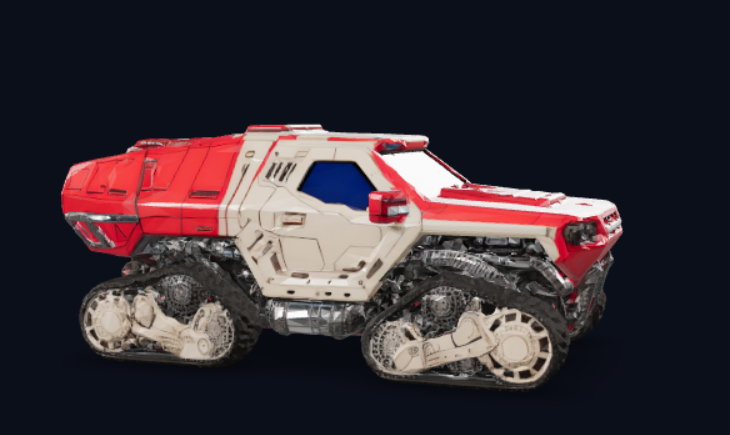

# Actividad de Clase: Analizando Agentes de IA con Hugging Face Spaces

------------------------------------------------------------------------

# Ficha de análisis

## 1. Nombre del Space

**Nombre:** Joan Stiven Peralta Bedoya

**Enlace:** https://huggingface.co/spaces/tencent/Hunyuan3D-2.1

------------------------------------------------------------------------

## 2. ¿Qué hace el agente?

El agente es capaz de generar modelos 3D apartir de imagenes que podemos exportar en formato jpg/jpge y png y descargar un modelo en formato gbl, stl o obj.

## Evidencia / Captura de la aplicación

------------------------------------------------------------------------

## 3. Análisis PEAS

| Elemento | Respuesta |
|----------|-----------|
| **Performance** | El agente hace bien su trabajo si genera un modelo 3D coherente y reconocible a partir de la imagen de entrada, con buena forma y sin errores de exportación. |
| **Environment** | Interactúa con la interfaz web del Space, el backend de generación 3D y los datos que el usuario carga (la imagen de entrada y las opciones de exportación). |
| **Actuators** | Produce la creación del modelo 3D, muestra la vista previa del objeto y genera archivos descargables en formatos `glb`, `stl` u `obj`. |
| **Sensors** | Recibe como entrada la imagen cargada por el usuario y cualquier parámetro de configuración disponible en la interfaz. |

------------------------------------------------------------------------

------------------------------------------------------------------------

## 4. Clasificación del entorno

Complete la siguiente tabla y justifique brevemente cada respuesta.

| Propiedad    | Clasificación | Justificación |
|-------------|---------------|---------------|
| Observable  | Parcial       | Solo se ve la imagen de entrada y el resultado final, no el estado interno del modelo ni los detalles del proceso de generación. |
| Determinista | No           | La generación de modelos 3D a partir de imágenes suele depender de un modelo entrenado y puede producir resultados distintos en distintas ejecuciones. |
| Episódico   | Sí            | Cada carga de imagen se procesa como una tarea independiente sin depender del historial de interacciones anteriores. |
| Estático    | No            | El entorno puede cambiar con nuevas imágenes, opciones o actualizaciones del modelo, y la acción del agente altera el resultado visible. |
| Discreto    | Sí            | Las entradas y salidas son eventos discretos: subir una imagen, generar el modelo y descargar el archivo. |
| Conocido    | No            | El agente no tiene acceso total a los detalles internos del proceso ni a la estructura completa del entorno de ejecución. |

------------------------------------------------------------------------

## 5. ¿Qué tipo de programa de agente creen que es?

Seleccione la opción que consideren más adecuada y explique por qué.

-   Agente de reflejo simple
-   Agente basado en modelo
-   Agente basado en objetivos
-   Agente basado en utilidad
-   Agente con aprendizaje

> **Importante:** No existe una única respuesta correcta. Lo importante
> es justificar la elección a partir del comportamiento observado.

**Respuesta:** Agente con aprendizaje.

**Justificación:** El sistema utiliza un modelo previamente entrenado para inferir un modelo 3D a partir de una imagen. Su comportamiento no se basa en reglas fijas de reflejo, sino en conocimientos adquiridos durante el entrenamiento, por lo que se ajusta mejor a un agente con aprendizaje.

------------------------------------------------------------------------

# Discusión en clase

-   ¿Dos Spaces diferentes pueden compartir el mismo tipo de entorno?
-   ¿Es posible saber con certeza qué tipo de agente implementa un Space
    únicamente observándolo?
-   ¿Qué diferencia existe entre el comportamiento observable de un
    agente y su implementación interna?

**Respuestas:**

-   Sí, dos Spaces diferentes pueden compartir el mismo tipo de entorno porque la clasificación depende de la estructura del entorno, no de la tarea específica, y muchos espacios comparten la misma estructura (por ejemplo los que trabajan con imagenes, siempre usan una interfaz sencilla de subir una imagen y darle un botón para que el agente haga una tarea especifica).
-   No, no es posible saber con certeza qué tipo de agente implementa un Space únicamente observándolo, porque la implementación puede ser distinta.
-   El comportamiento observable es lo que el usuario ve: entradas, salidas y reacciones. La implementación interna es el mecanismo oculto que genera ese comportamiento, como redes neuronales, reglas o estados internos.

------------------------------------------------------------------------

# Reto adicional

Encuentre un Space que pueda clasificarse como:

1.  **Totalmente observable, determinista y episódico.**

    Un Space de clasificación de imágenes simple, donde cada imagen se etiqueta de forma independiente. En este caso el entorno es totalmente observable porque la entrada es completa, determinista porque la misma imagen da la misma etiqueta con las mismas condiciones, y episódico porque cada carga de imagen es un episodio separado.

2.  **Parcialmente observable, estocástico y secuencial.**

    Un Space de chatbot o generación de texto que responde a mensajes. El agente no ve toda la intención interna del usuario, sus respuestas pueden variar aunque el mensaje sea igual (estocástico) y cada interacción depende del contexto anterior (secuencial).

------------------------------------------------------------------------

# Rúbrica (10 puntos)

| Criterio | Puntos |
|-----------|:------:|
| Descripción correcta del Space | 2 |
| Identificación de PEAS | 3 |
| Clasificación del entorno | 3 |
| Justificación del tipo de agente | 2 |
| **Total** | **10** |

------------------------------------------------------------------------
